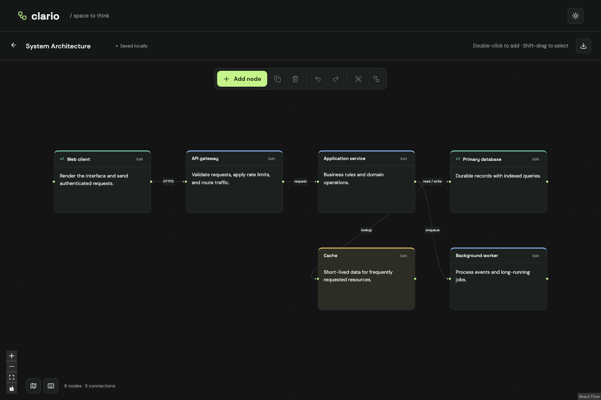
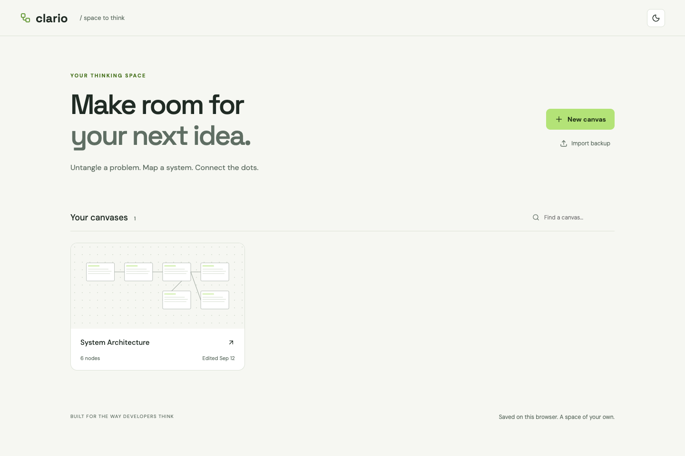

# Clario

A visual thinking and flow-mapping application for developers. Untangle an algorithm, sketch a system, or map an idea using connected text and code nodes.

**Create a canvas → add nodes → write ideas or code → connect and organize → autosaved.**



## Run locally

Requires Node.js 22.12+ and npm. Developed and verified with Node.js 24 and Chrome on macOS.

```sh
npm install
npm run dev -- --host 127.0.0.1
```

Open **http://127.0.0.1:5173**. Keep the same host and port when returning to your saved canvases: browser storage is scoped to the origin. No API keys, account, database, or server setup is needed.

```sh
npm run build         # TypeScript checks and production bundle
npm run preview       # Serve the production bundle
npm run lint          # Static checks
npm test              # Browser tests; local Chrome required
npm run format:check  # Check source formatting
```

The test runner starts a development server when needed. To test a running production preview, use `CLARIO_BASE_URL=http://127.0.0.1:4173 npm test`.

## Features

- Infinite-style canvas with pan/zoom, double-click creation, movement, resizing, multi-selection, duplication, deletion, and optional minimap.
- Standard, process, decision, input/output, note, and code nodes.
- Rich text: bold, italic, underline, strikethrough, headings, font sizes, bullet/numbered lists, inline code, alignment, and HTTP(S) links.
- Contextual formatting toolbar. Click **Edit** or double-click the content; use **Done** or Escape to finish rich-text editing. Drag anywhere on the reading card—including text, code, and its title—to move it. Double-click content or the title to edit; text selection stays inside the editor until you finish. Dedicated buttons and connection handles keep their normal actions.
- Code with language selection, syntax-highlighted reading mode, plain-text editing, indentation with Tab, and copying. Includes JavaScript, TypeScript, Python, Java, C, C++, Swift, SQL, shell, JSON, CSS, and HTML.
- **Auto connect / Freehand** toggle: automatic obstacle routing or your own drawn stroke. In Freehand mode, start on any dot and release near another card’s dot; a highlighted ring previews the snap. Escape cancels. Drawn wires stay attached as cards move. Select a drawn wire to switch between Automatic and My drawing.
- Thicker wires and prominent arrowheads. Drag labels along their wires; resize selected labels with the corner grip or the label-size slider. Label geometry autosaves and supports undo/redo.
- Directional connections with rounded right-angle routing, automatic detours around cards, optional labels, and solid/dashed lines. Drag from any side dot to any side dot on another card, then select a connection to customize it.
- Movable, resizable sections. Select related nodes and group them; ungroup preserves their positions.
- Diagram undo/redo with up to 100 checkpoints. Continuous edits coalesce; selection and measurement changes do not enter history. Rich-text editing also supports the editor’s native undo shortcuts.
- Local autosave of content, connections, sizes, positions, names, and viewport. Dashboard previews, search, rename, and delete.
- Downloadable JSON backups and import as an independent canvas.
- Six templates: Blank, Algorithm / LeetCode, System Architecture, User Flow, Project Planning, and Concept Map.
- Dark/light themes, local fonts, responsive controls, labeled inputs, focus-managed dialogs, and reduced-motion support.



## Keyboard shortcuts

Use ⌘ on macOS or Ctrl on Windows/Linux. Diagram shortcuts leave active text fields alone.

| Shortcut               | Action                                           |
| ---------------------- | ------------------------------------------------ |
| N                      | New standard node                                |
| ⌘/Ctrl D               | Duplicate selection and its internal connections |
| Delete / Backspace     | Delete selection                                 |
| ⌘/Ctrl Z               | Undo                                             |
| ⌘/Ctrl Shift Z, Ctrl Y | Redo                                             |
| ⌘/Ctrl A               | Select all nodes                                 |
| ⌘/Ctrl G               | Group selected standalone nodes                  |
| ⌘/Ctrl Shift G         | Ungroup selected sections                        |
| + / −                  | Zoom                                             |
| 0                      | Fit diagram                                      |
| Shift + drag           | Select an area                                   |
| ⌘/Ctrl + click         | Add/remove a node from selection                 |
| / while editing        | Insert a heading, list, or inline code           |
| ?                      | Shortcut reference                               |

## Persistence and backups

Canvases are stored in versioned JSON records in `localStorage`, one record per canvas. Each content change is saved locally; no network requests carry diagram data. Transient selection and measurement state is excluded. Saving errors remain visible, and unreadable saved records are preserved rather than replaced.

Use **Download backup** in the canvas header to save a `.clario.json` file. **Import backup** on the dashboard restores it as a separate editable canvas. If storage is unavailable or full, download a backup before leaving the page.

## Architecture

React 19 + TypeScript + Vite, React Flow 12 for diagram interactions, Tiptap 3/ProseMirror for text editing, Lowlight/highlight.js for syntax, Lucide icons, and locally bundled DM Sans/Space Grotesk fonts. The canvas is loaded on demand; canvas, rich-text, and syntax dependencies are split into separate bundles.

```text
src/
  App.tsx                  Routes and theme preference
  components/
    Dashboard.tsx          Canvas library and management
    Canvas.tsx             Controlled canvas and document lifecycle
    CanvasToolbar.tsx      Canvas actions
    BlockNode.tsx          Node shell, title, and content type
    RichEditor.tsx          Tiptap editor and contextual formatting
    CodeEditor.tsx          Source editing, highlighting, copying
    WireLabel.tsx          Draggable labels and resize grips
    FreehandPreview.tsx    Live drawing and snap feedback
    RoutedEdge.tsx         Obstacle-aware wire rendering
    SelectionPanel.tsx      Node and connection options
    CanvasPreview.tsx      Lightweight dashboard SVG previews
    Dialog.tsx             Native accessible modal shell
    TemplatePicker.tsx     Starting point selection
  lib/
    types.ts               Diagram/document model and node factory
    storage.ts             Versioned local persistence and backup import
    useAutosave.ts         Save status and downloadable backups
    useDiagram.ts          Diagram updates and history
    freehand.ts            Stroke geometry attached to moving endpoints
    useFreehand.ts         Pointer drawing, snapping, and cancellation
    routing.ts             Orthogonal pathfinding and rounded paths
    operations.ts          Duplication, grouping, ungrouping
    useCanvasShortcuts.ts  Keyboard interactions
    templates.ts           Editable starting diagrams
  App.css                  Theme and component styling
  index.css                Local fonts and global reset

tests/                     Browser interaction and accessibility tests
docs/PRODUCT_BRIEF.md       Original requirements
docs/screenshots/          Dark, light, and mobile screenshots
```

## Validation

The browser suite covers node creation/movement/resizing, connection creation/styling, multi-selection, rich text, code highlighting and copying, groups, undo/redo, keyboard shortcuts, slash commands, all templates, save/close/reopen, management, backup restoration, storage failures, corrupted records, a 100-node diagram, viewport restoration, narrow screens, theme persistence, and automated WCAG A/AA checks on representative screens.

Release verification: **19 browser tests passed against the production build**, with clean TypeScript/build, lint, and formatting checks.

All eight milestones were implemented in order, with milestone commits and verification. See Git history for implementation checkpoints.

## Known limitations

- Storage belongs to one browser and origin. Clearing site data removes canvases; use backups for portability. No cloud sync or simultaneous multi-tab editing guarantees.
- Local storage has a browser-defined size limit. Very large diagrams and long code blocks can reach it; failures are shown rather than reported as saved.
- History is session-local, and title edits in plain input fields follow native input undo behavior. There is no persistent version history.
- Freehand wires retain your drawn route rather than automatically avoiding cards. Unattached strokes are discarded when released; connectors join two cards.
- Wire crossings can remain in dense diagrams. Overlapping cards or blocked ports fall back to a simple rounded route.
- Sections are a single organizational level; nested section creation is intentionally excluded.
- Code is highlighted in reading mode; the editing surface is plain text rather than a full IDE.
- Mouse and keyboard are the primary editing workflow. Narrow layouts are checked, but touch-specific gesture behavior has not been comprehensively tested on physical devices.
- Automated accessibility checks do not replace assistive-technology testing. Browser verification currently targets Chrome on macOS.
- V1 has no AI, accounts, collaboration, teams, comments, or repository analysis.
